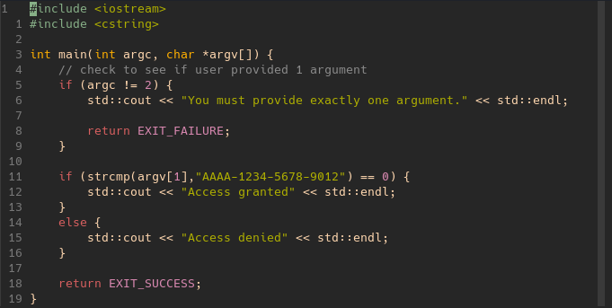
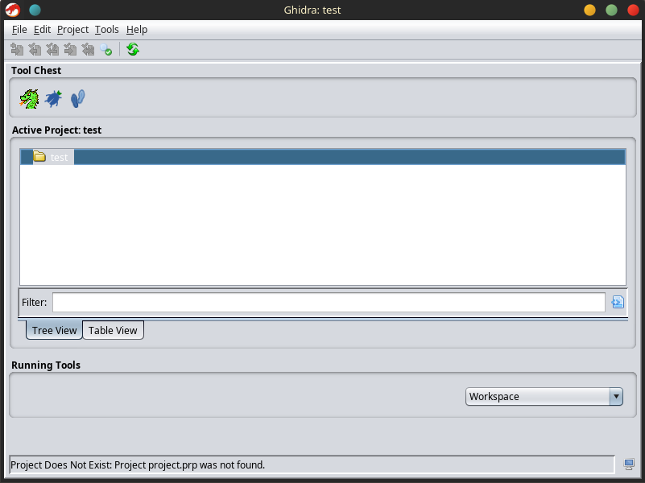
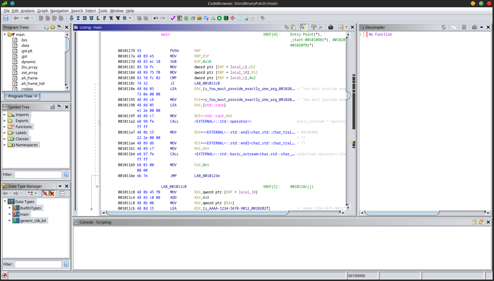
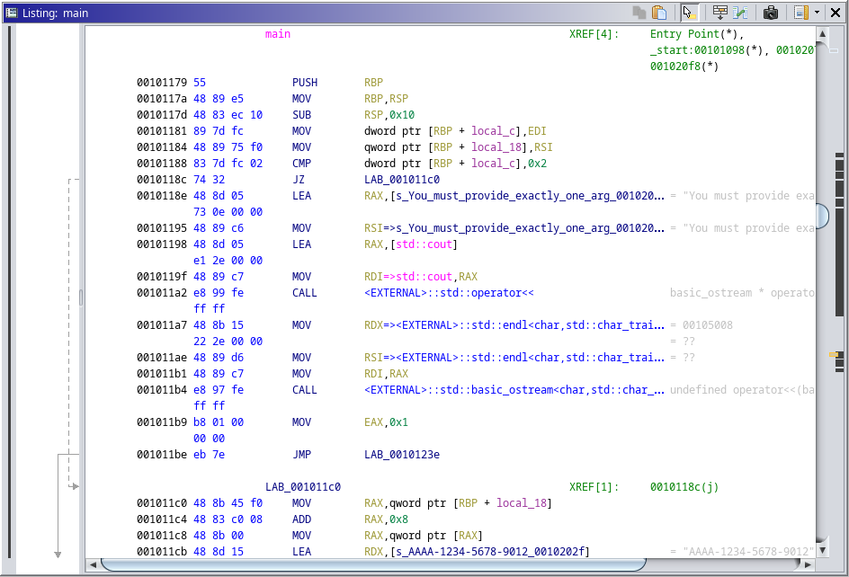
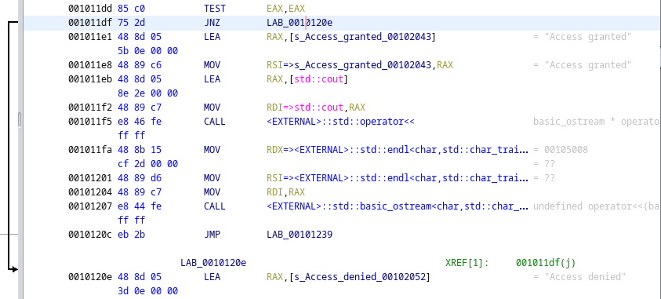
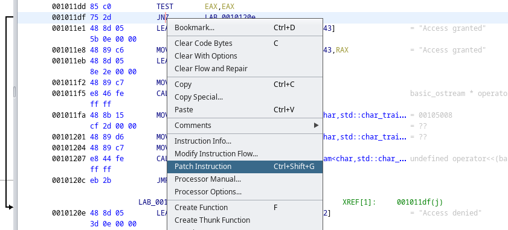
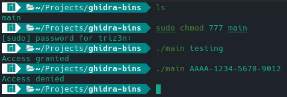

+++
title = 'Intro to Binary Patching'
date = 2024-03-10T12:11:55-04:00
draft = false
+++

I recently took an interest in patching binary files and began doing some research over the topic. This research led me to a few YouTube videos and other various articles. In this blog post I will attempt to summarize my findings into a simple and informative lesson.

### Dependencies
* [Ghidra](https://ghidra-sre.org/)
* [gcc](https://gcc.gnu.org/)
* [Example code](https://github.com/JonathanShrek/Intro-Binary-Patching-Example/tree/master)

### Patching a Binary File
To begin, download and clone the above dependencies. Next, move to the directory where you cloned the example code file and then move into the "src" folder. Here you will find a .cpp file and a binary that was built from this .cpp file. The binary was built using the following command:

```g++ main.cpp -o main```

If you open up the .cpp file in a text editor you can see that it is a very simple program that takes in exactly one argument provided by the user. If this argument matches the access code then the program returns the string "Access granted". If the user provides an argument that does not match the access code then the program returns "Access denied".



You can run the program by executing the following command:

```./main AAAA-1234-5678-9012```

This will run the program and "Access granted" will print to the terminal window. Using any other argument besides the access code will print "Access denied" to the terminal window.

Now that we have the binary that we want to patch, we can now open Ghidra. Ghidra is a software reverse engineering suite developed by NSA's Research Directorate. Ghidra is open source and is completely free. It is a great tool to get started with reverse engineering software.

When you open Ghidra you are presented with the following screen. Ghidra is project based so to get started we will have to create a new project. To do this click "File" in the top left corner and then click "New Project". 



Once you have your project created you can then click "File" again and this time select "Import File...". From here, navigate to the example code directory and select the binary file to import. A window will pop up showing format, language, destination folder, and program name. For this example, go ahead and just click "OK". Next, click the "CodeBrowser" tool in the tool chest. Once in the CodeBrowser tool, click "File" and then "Open". Here you can select the binary file that we just imported. The CodeBrowser tool will ask if you would like to analyze the file, just click "Yes" and then on the next screen click "Analyze".




Scroll down to where we begin to see the code from the .cpp file being called. In this case its easy because we can see the string stating that the user of the program must provide exactly one argument.

The text on the left side of the code window are memory addresses, the middle and left side of the screen is x64 assembly. For this example we are only looking for the JZ/JNZ assembly instructions. JZ essentially means jump if equal and JNZ means jump if not equal. Our example code is doing a check to determine if our argument matches the access code. Ghidra makes it very easy to see that a JNZ instruction is being used to jump to the "Access denied" block if the argument does not match the access code.



In order to bypass this check and get to the "Access granted" block regardless if our argument matches the access code, we simply have to make one small change. If we right click the JNZ instruction that is directing us to the "Access denied" block we can select an option called "Patch Instruction".



Now the JNZ instruction is able to be modified. We can simply change this instruction to a JZ. This means that we can use anything but the correct access code and we will always get "Access granted". By using the correct access code the instructions will now jump to the "Access denied" block. Once you have changed JNZ to JZ click the save icon at the top left of the CodeBrowser tool.

We are now ready to test our newly patched binary. Click "File" and then click "Export Program...". Select an output path for the file and then click "OK". The modified binary is now in your file system, but in order to run the file we must update the permissions on the file itself.



Once the permissions have been updated run the program with a random argument and you will see that you now get "Access granted" printed in the terminal window. If you run the program with the correct access code as the argument you now get "Access denied". This is exactly what we expected to happen.

And thats about it. In this lesson you learned how to do a very basic patch on a binary file to bypass an access code.
