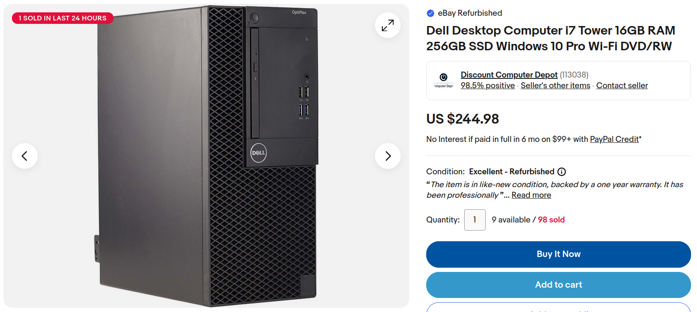
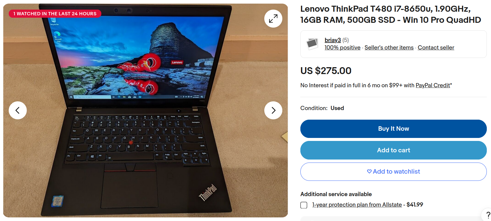

+++
title = 'Recommended Computer Equipment'
date = 2024-03-12T20:11:08-04:00
draft = true
toc = false
+++

As a professional nerd, I have had many people ask me for my opinion on various computer purchases. Because of this, I have decided to write a small blog post to list out a few of my own personal recommendations for different computing scenarios.

## Gaming Desktops

Let's start with one of the most common computer purchase questions that I get asked, "Should I buy this pre-built gaming pc??". I'm not the biggest fan of pre-built gaming PC's just because I feel you can get more for your money by just building your own. Let's take a look at just a few pre-built gaming desktops and compare those with a few custom build options.

Of course, it all comes down to what you want in your setup. If you want to game at 4k resolution and maintain 60fps then you will obviously need a much beefier setup than if you were just wanting to game at 1080p at 30fps. For the sake of simplicity, I will just focus on a basic 1080p 60fps+ gaming PC.

*insert image*

## Basic Desktops

If you are just looking for a basic desktop for casual use or even professional work, you have some great options to choose from. I personally would recommend a used Dell Optiplex. You can find a variety of different specs to suit your needs and most of them are easily upgradable. Most are listed at a reasonable price as well. A lot of companies offload these whenever they run out of warranty and upgrade their systems. In short, business grade desktop for an affordable price with a variety of options for specs.

Here is one great option that I found from a quick search. 

## Gaming Laptops

Don't. Just don't.

Stay far away. The laptop form factor does not allow for adequate airflow, especially for the components required for high performance gaming. Components are soldered and cannot be easily replaced either. You will pay through the nose for a decent gaming laptop and it will fail.

## Basic Laptops

Just like with a basic desktop, you have many options to choose from when looking for a laptop to use for casual use or even professional work. I would once again recommend you look at the used market for the same reasons as with the basic desktop. Many companies offload their laptops once the warranties are out and you can grab a professional grade laptop for relatively cheap. Some of the Lenovo Thinkpads are excellent options because of price, but also repairability. For instance, a Thinkpad T480 can have pretty much everything repaired on it for cheap.

Here is another great option that I found from a quick search. 

