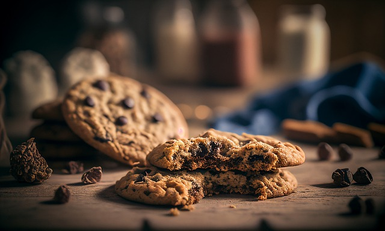

+++
title = 'Chocolate Chip Cookies'
date = 2024-03-24T18:00:31-04:00
draft = false
+++

This recipe makes around 20 cookies.

## Ingredients

* 2 cups of all-purpose flour
* 1 teaspoon baking soda
* 1/2 teaspoon salt
* 1 cup of butter, barely melted and not too hot
* 3/4 cup of light brown sugar, packed
* 2/3 cup granulated sugar
* 2 teaspoons of vanilla extract
* 1 teaspoon of apple cider vinegar
* 1 large egg
* 2 cups of semisweet chocolate chips
* Coarse sea salt

## Instructions

1. Preheat the oven to 350 degrees Fahrenheit and line a baking sheet with parchment paper.

2. In a medium bowl, mix together the flour, baking soda, and salt. Set aside.

3. In a large bowl, beat together the butter, sugars, vanilla extract, and the vinegar until smooth. Beat in the egg just until combined.

4. Mix the flour mixture into the wet mixture just until combined. Stir in the chocolate chips.

5. Using a large cookie scoop (about 2 rounded tablespoons), drop the dough about 3 inches apart onto the cookie sheet.

6. Bake for 8 to 10 minutes. They will look light brown around the edges and will look underdone in the center.

7. Remove from the oven and immediately sprinkle each cookie with a little sea salt.

8. Allow to sit on the sheet for 10 minutes before moving to a rack to cool.
