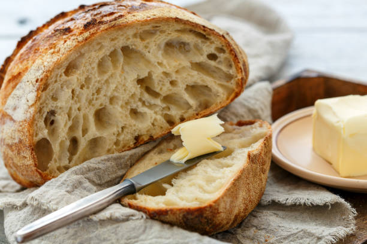

+++
title = 'Sourdough'
date = 2024-03-24T16:24:18-04:00
draft = false
+++

Recently I have been diving into the world of bread baking. It all started after watching a 
Jacques Pépin video where he showed how to make a basic loaf of bread. I made the loaf from the video a few times, and then I was hooked. I then began to set my sights on making a loaf of sourdough bread, but was intimidated because of the starter. Finally, I had worked up enough courage and created my own starter. I then needed a recipe, so I began to search around on YouTube and eventually found [one](https://youtu.be/kp3ZYkzbg9Q) that I liked enough to give a shot.

This recipe will create 2 loaves. Half the measurements for a single loaf.

## Items Required

* Dutch oven
* Parchment paper
* Oven
* Mixing bowls

## Ingredients

* 500g unbleached all-purpose flour
* 200g whole wheat flour
* 250g unbleached all-purpose flour/bread flour
* 650g room temperature/warm water
* 200g sourdough starter
* 20g fine sea salt

## Instructions

1. Combine the first 4 ingredients and then let sit for 30 minutes covered with a damp tea towel (autolyse).

2. Use wet hands to combine the starter and salt with the dough.

3. Let the dough rest in a warm spot for about 30 minutes before starting the stretching and folding process.

4. Stretch and fold every 15 minutes for the first 3 times and then every 30 minutes for the last 3 times for a total of 6 stretch and folding sessions.

5. Cover with a damp tea towel for the rest of the day (no later than 6pm if you wish to bake at 8am).

6. Remove dough from bowl onto a lightly floured surface.

7. Cut into 2 with a dough knife.

8. Form the 2 doughs into a ball.

9. Let sit at room temperature for about 30 minutes.

10. Flip dough balls over and then fold the sides toward the center.

11. Roll back over and then put the seam side up into a lightly floured, linen lined basket or bowl.

12. Cover bowls with plastic and then place into the fridge overnight (12-14 hours).

13. The next day, pre-heat the oven to 500 degrees Fahrenheit with your dutch oven inside to begin heating.

14. Take 1 bowl out of the fridge and then gently flip over to reveal a nice puffy ball of dough onto a piece of parchment paper.

15. Dust the top of the dough lightly with a bit of flour and then score a design into the dough with a blade.

16. Place gently into hot dutch oven (on parchment paper), close the lid and then bake at 500 degrees Fahrenheit for about 20 minutes.

17. Reduce the temperature to 475 degrees Fahrenheit, remove the lid and bake for another 25 minutes to create a nice crust.
